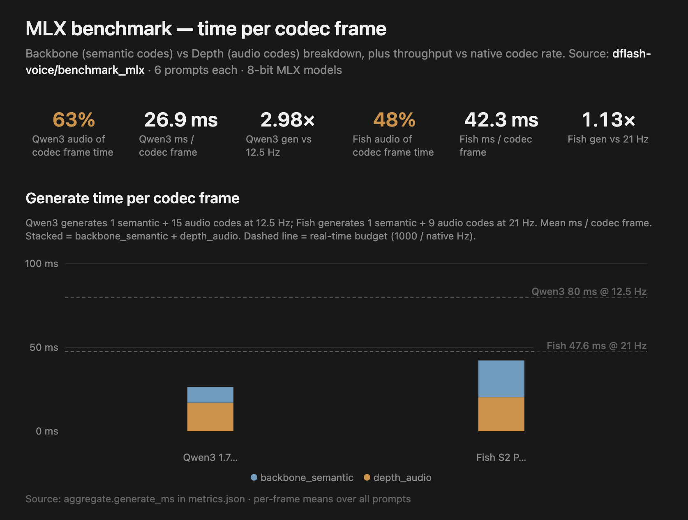
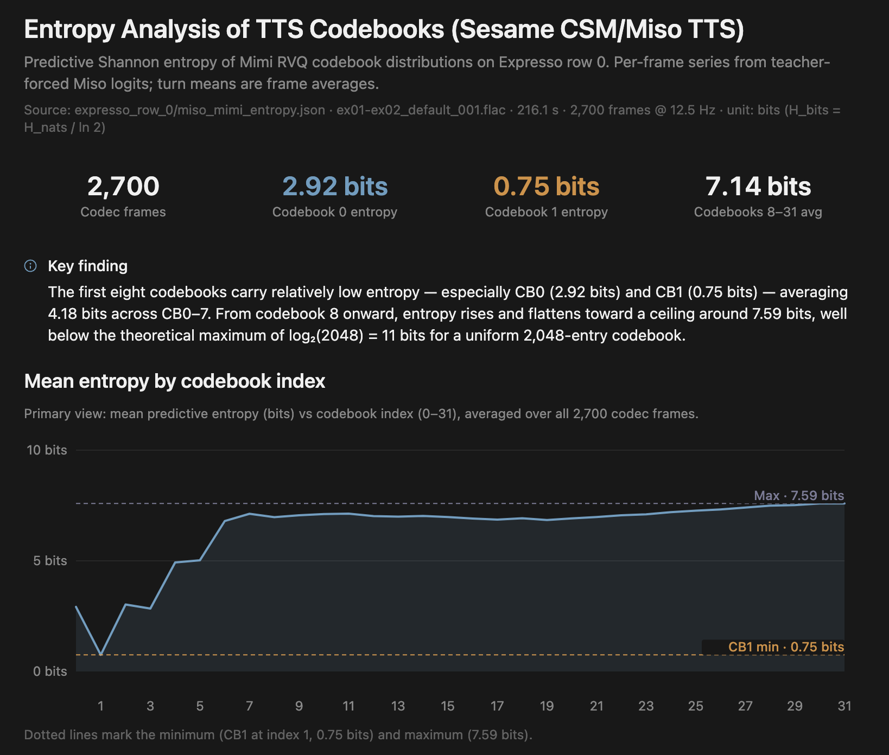
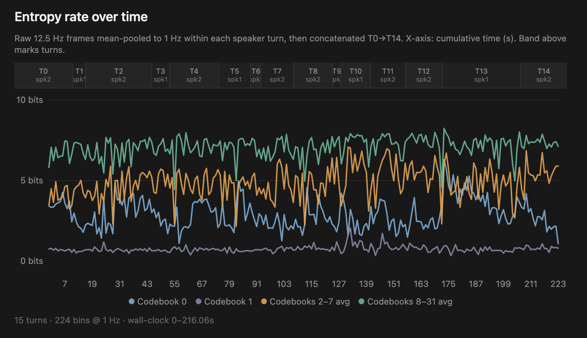

# dflash-voice: Accelerating RVQ audio codec generation

The goal of this project is to speed up TTS and multimodal voice LLM inference, starting with RVQ (residual vector quantization) audio codec generation. This forms a surprisingly large bottleneck (i.e. orange bars below), complicating inference especially when running locally. See breakdown for 2 SoTA models (Qwen3 TTS, Fish Audio S2) below.



This is currently WIP, to read a little more about the motivation and approach, see section [Why](#why) below.


## Install

```bash
uv pip install -e ".[tts_mlx,dev]"
```

Pinned deps match mlx-audio's tested stack (`mlx-lm==0.31.1`, `transformers==5.6.0`).

## Quick start

```bash
# Will download models to HF_CACHE on first run
python benchmark_mlx/bench_tts_mlx.py --backend qwen3
python benchmark_mlx/bench_tts_mlx.py --backend fish
```

This will help reproduce benchmark results shown above on a local Apple Silicon laptop with MLX support.

## Benchmark results (per-codec-frame breakdown)

6 prompts per model, 8-bit MLX checkpoints, 64GB M1 Max Apple Silicon. **Gen RTF** = codec-frame generation speed vs native frame rate; **Wall RTF** = end-to-end including codec decode.

Real-time budgets: Qwen3 @ 12.5 Hz → 80 ms/frame; Fish @ 21 Hz → 47.6 ms/frame.

| Model | Native | Backbone (semantic codes) | Depth (audio codes) | Depth % | Depth iters | ms / depth iter | Total ms | Codec frames/s | Gen RTF | Wall RTF |
|-------|--------|---------------------------|---------------------|---------|-------------|-----------------|----------|----------------|---------|----------|
| Qwen3 1.7B 8bit | 12.5 Hz | 9.4 ms | 17.0 ms | 63% | 15 | 1.13 ms | 26.9 ms | 37.2 | 2.98× | 2.52× |
| Fish S2 Pro 8bit | 21 Hz | 21.9 ms | 20.4 ms | 48% | 9 | 2.26 ms | 42.3 ms | 23.7 | 1.13× | 0.92× |

Raw metrics: (gitignored — regenerate with `benchmark_mlx/bench_tts_mlx.py`).

## Why 

This started after noticing an expensive memory bottleneck for audio tokens mentioned in the [Sesame CSM blog post](https://www.sesame.com/blog/crossing-the-uncanny-valley-of-voice). Why should audio tokens be comparably expensive to predict vs language tokens? Especially given the lower information density.

Taking a closer look at the predictive entropy over 32 [Mimi](https://huggingface.co/kyutai/mimi) RVQ codebooks for the [MisoTTS](https://github.com/MisoLabsAI/MisoTTS) depth audio decoder (8B repro of the CSM model) confirms this. The first 7 codebook tokens have quite low entropy/information content - as low as 0.75 bits. Do we really always need 32x300M param forward passes to generate 32 RVQ audio tokens?



From an information theory lens: there is clearly a varying rate of information density, both across depth (RVQ audio codebooks - first plot) time (codec frames - plotted below). Most modern TTS models (e.g. Qwen3 TTS, Fish Audio S2) have converged to an autoregressive 1-4B LLM `backbone_semantic` predicting semantic codes across time and smaller 100-400M `depth_audio` decoders predicting audio RVQ codebooks across depth.



Given what we've seen above, and inspired by speculative decoding and flow matching, it would be nice to get more bang for buck per model forward pass. Why not spend less compute on the easy stuff?

Specifically, I am exploring both discrete and continuous approaches to generating RVQ audio tokens faster.
1. Discrete: block-diffusion inspired by speculative decoding methods like [DFlash](https://github.com/z-lab/dflash)
2. Continuous: single-step flow matching inspired by [MeanFlows](https://github.com/Lyy-iiis/imeanflow)

More to come here soon. Feel free to [connect/reach me](https://akashmjn.me/) if you've any thoughts!

> P.S.: original project motivation (and repo naming) was the question: how can we do speculative decoding for TTS/multimodal voice models? Turns out specdec for TTS is complicated by the dual-RVQ (semantic backbone + audio depth decoder) codec structure used by most SoTA models. So the initial project focus is first on a narrower bottleneck: training models to speed up/simplify RVQ audio codec generation to begin. Will revisit/rename appropriately based on progress :)

## Citation

If you use this repository, please cite:

```bibtex
@misc{mahajan2026dflashvoice,
  title        = {dflash-voice: Accelerating RVQ audio codec generation for TTS},
  author       = {Mahajan, Akash},
  year         = {2026},
  howpublished = {GitHub},
  url          = {https://github.com/akashmjn/dflash-voice}
}
```

### Related work

```bibtex
@misc{sesame2024csm,
  title        = {Crossing the uncanny valley of voice},
  author       = {{Sesame}},
  year         = {2024},
  howpublished = {Blog post},
  url          = {https://www.sesame.com/blog/crossing-the-uncanny-valley-of-voice}
}

@article{Qwen3-TTS,
  title   = {Qwen3-TTS Technical Report},
  author  = {Hangrui Hu and Xinfa Zhu and Ting He and Dake Guo and Bin Zhang and Xiong Wang and Zhifang Guo and Ziyue Jiang and Hongkun Hao and Zishan Guo and Xinyu Zhang and Pei Zhang and Baosong Yang and Jin Xu and Jingren Zhou and Junyang Lin},
  journal = {arXiv preprint arXiv:2601.15621},
  year    = {2026}
}

@misc{liao2026fishaudios2technical,
  title         = {Fish Audio S2 Technical Report},
  author        = {Shijia Liao and Yuxuan Wang and Songting Liu and Yifan Cheng and Ruoyi Zhang and Tianyu Li and Shidong Li and Yisheng Zheng and Xingwei Liu and Qingzheng Wang and Zhizhuo Zhou and Jiahua Liu and Xin Chen and Dawei Han},
  year          = {2026},
  eprint        = {2603.08823},
  archivePrefix = {arXiv},
  primaryClass  = {cs.SD},
  url           = {https://arxiv.org/abs/2603.08823}
}

@techreport{kyutai2024moshi,
  title       = {Moshi: a speech-text foundation model for real-time dialogue},
  author      = {Alexandre D\'efossez and Laurent Mazar\'e and Manu Orsini and Am\'elie Royer and Patrick P\'erez and Herv\'e J\'egou and Edouard Grave and Neil Zeghidour},
  year        = {2024},
  eprint      = {2410.00037},
  archivePrefix = {arXiv},
  primaryClass  = {eess.AS},
  url         = {https://arxiv.org/abs/2410.00037}
}
```
