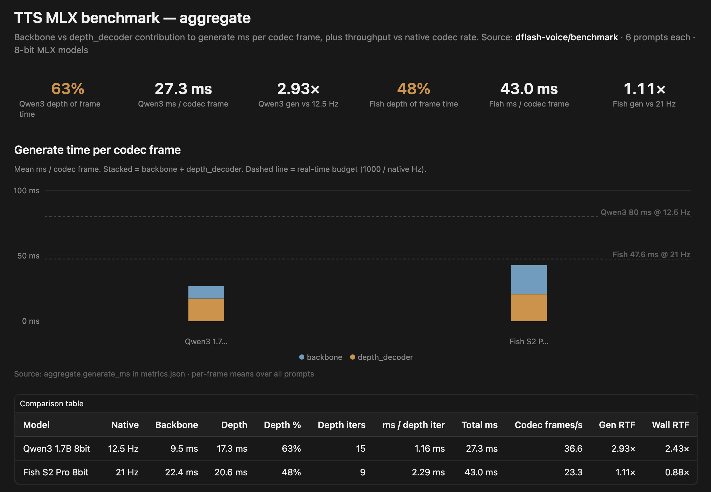

# dflash-voice

Readable MLX TTS inference and benchmarking for **Qwen3-TTS** and **Fish Audio S2 Pro**, ported from [mlx-audio](https://github.com/Blaizzy/mlx-audio) 0.4.4. Inference loop is ported to understand key components and benchmark per-frame timing (backbone vs depth decoder).

## Current state

| Area | Status |
|------|--------|
| **Qwen3-TTS** (`tts_mlx/qwen3.py`) | Base preset-voice generate loop ported; streaming supported |
| **Fish S2 Pro** (`tts_mlx/fish.py`) | DualAR generate loop ported; inline `[tag]` control supported |
| **Parity tests** | `tests/test_*_generate.py` compare output against mlx-audio reference |

Weights and `nn.Module` definitions still come from mlx-audio; `tts_mlx` owns prompt construction, autoregression, and codec decode in annotated, single-file modules.

## Install

```bash
uv pip install -e ".[tts_mlx,dev]"
```

Pinned deps match mlx-audio's tested stack (`mlx-lm==0.31.1`, `transformers==5.6.0`).

## Quick start

```bash
# Will download models to HF_CACHE on first run
python benchmark_tts_mlx.py --backend qwen3
python benchmark_tts_mlx.py --backend fish
```

## Benchmark results (aggregate)

6 prompts per model, 8-bit MLX checkpoints, 64GB M1 Max Apple Silicon. **Gen RTF** = codec-frame generation speed vs native frame rate; **Wall RTF** = end-to-end including codec decode.



| Model | Native | Backbone | Depth | Depth % | Depth iters | ms / depth iter | Total ms | Codec frames/s | Gen RTF | Wall RTF |
|-------|--------|----------|-------|---------|-------------|-----------------|----------|----------------|---------|----------|
| Qwen3 1.7B 8bit | 12.5 Hz | 9.5 ms | 17.3 ms | 63% | 15 | 1.16 ms | 27.3 ms | 36.6 | 2.93× | 2.43× |
| Fish S2 Pro 8bit | 21 Hz | 22.4 ms | 20.6 ms | 48% | 9 | 2.29 ms | 43.0 ms | 23.3 | 1.11× | 0.88× |

Real-time budgets: Qwen3 @ 12.5 Hz → 80 ms/frame; Fish @ 21 Hz → 47.6 ms/frame.

Raw metrics: `benchmark/qwen3/qwen3-tts-12hz-1.7b-base-8bit/metrics.json`, `benchmark/fish/fish-audio-s2-pro-8bit/metrics.json` (gitignored output dir — regenerate with `benchmark_tts_mlx.py`).
