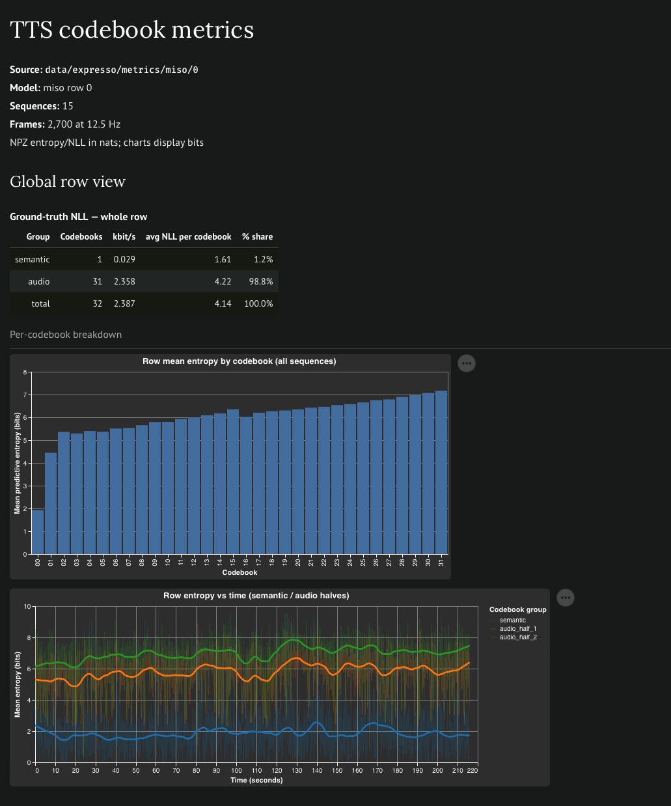

# Analysis on the Expresso dataset

Analysis of TTS model predictions over codebooks - predictive entropy, teacher-forced NLL (CE loss) of ground-truth audio codes on samples from the Expresso dataset.

Results below are averaged over the first 10 Expresso dataset rows (`--rows 10`) ~4300 seconds:


| Model   | Codebooks | Frame rate (Hz) | Semantic NLL (nats) | Audio NLL/codebook avg (nats) | Semantic kbit/s | Audio kbit/s | Total kbit/s |
| ------- | --------- | --------------- | ------------------- | ----------------------------- | --------------- | ------------ | ------------ |
| `miso`  | 32        | 12.5            | 1.79                | 4.29                          | 0.032           | 2.397        | 2.429        |
| `qwen3` | 16        | 12.5            | 8.31                | 5.81                          | 0.150           | 1.571        | 1.721        |
| `fish`  | 10        | 21              | 4.56                | 4.79                          | 0.138           | 1.306        | 1.445        |


- We compute the Teacher-forced NLL (CE loss) and compare the predictive compression of various models — how many bits each model spends to reproduce the ground-truth audio codes. Lower value means better predicted/compressed.
- This normalizes for per-model differences in frame rate and codebook vocabulary size making it more comparable.  
- All three land in a similar 1.4–2.4 kbit/s band despite differing frame rates. `miso` spends the most (~1.7× `fish`) but spreads it over 32 codebooks, so its per-codebook cost is the lowest of the three; it also has by far the cheapest semantic stream, predicting codebook 0 at 1.79 nats.

Notes on calculation:

- For multiple audio RVQ codebooks we average `avg NLL per codebook = avg_K (NLL_k); K=num_codebooks`. This is directly the NLL/CE loss for semantic codes.
- It is then normalized to `kbits/s` computed as  `kbits/s = avg NLL per codebook × num_codebooks x log2(e) × frame_rate / 1000` - representing the information content in model predictions on the validation data.

Included `marimo` notebook allows diving deeper:

- **Global view** — averaged metrics per-codebook and as a grouped time series over the whole file.
- **Per-segment explorer** — the same views for one selected sequence in the file.



## Reproduce

Run from the repo root. Each step feeds the next:

**1. Dataprep** — tokenize + featurize a model's rows into `data/DATASET/featurized/MODEL/ROW/` (DATASET defaults to `expresso`):

```bash
uv pip install -e ".[dataprep]"
python -m dataprep.prepare --model miso --stage all --rows 10
```

**2. Compute metrics (negative log likelihood - NLL, predictive entropy)** — read the featurized rows summarize model logits and write to `data/DATASET/metrics/MODEL/ROW/MODEL_metrics.{npz,json}`:

```bash
python analysis/model_metrics.py compute --model miso
```

`summarize` pools computed rows into the per-model table below with `--rows N` for just the first N:

```bash
python analysis/model_metrics.py summarize --rows 10
```

**3. Explore** — open the marimo notebook and pick a model / row:

```bash
marimo edit notebooks/metrics_explore.py
```

