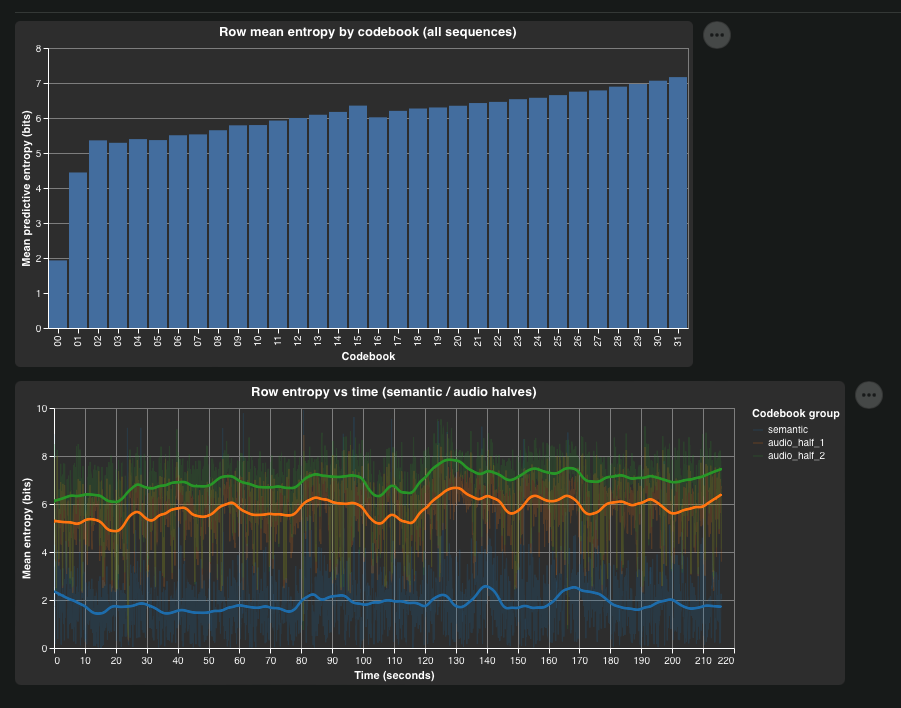

# Quantifying TTS model compression and predictive uncertainty

We explore TTS model predictions over tokenized audio from an information theory lens in two ways:
1. Measuring validation negative log-likelihood (NLL) and calculating the implied compression rate
2. Exploring per-RVQ codebook predictive entropy

Analysis is done on a subset of the 40hr [Expresso dataset](https://huggingface.co/datasets/Zackh/expresso-contextual). TTS models compared: [Qwen3-TTS/1.7b-base](https://huggingface.co/Qwen/Qwen3-TTS-12Hz-1.7B-Base), [Fish-Audio/S2-Pro-4b](https://github.com/fishaudio/fish-speech), [SesameCSM/Miso-8b](https://github.com/MisoLabsAI/MisoTTS).

This motivates a study of techniques to parallelize generation of low-information tokens to increase model throughput (e.g. speculative decoding + block-diffusion [DFlash](https://github.com/z-lab/dflash)).


## Comparing validation NLL & implied compression rate

Models are validated on ground truth tokenized (text, audio) sequences to compute `NLL`, and then normalized to `kbit/s`. We can intepret this as: how many bits each model spends to predict ground-truth audio tokens per second.
> This normalizes model differences in frame rate and codebook vocabulary and gives us an interpretable value - lower means better predicted/compressed.

| Model   | Codebooks | Frame rate (Hz) | Semantic NLL (nats) | Audio NLL/codebook avg (nats) | Semantic kbit/s | Audio kbit/s | Total kbit/s |
| ------- | --------- | --------------- | ------------------- | ----------------------------- | --------------- | ------------ | ------------ |
| `fish`  | 10        | 21              | 4.56                | 4.79                          | 0.138           |  1.306       | **1.445**    |
| `qwen3` | 16        | 12.5            | 8.31                | 5.81                          | 0.150           |  1.571       | **1.721**    |
| `miso`  | 32        | 12.5            | 1.79                | 4.29                          | 0.032           |  2.397       | **2.429**    |

- NLL is normalized to `kbits/s` computed as  `kbits/s = avg NLL per codebook × num_codebooks x log2(e) × frame_rate / 1000`
- Computed over a subset of first 10 dataset rows (`--rows 10`) ~4300 seconds by tokenizing, running a forward pass + dumping logits
- See module [dataprep](../../dataprep/) for more


## Per-RVQ codebook predictive entropy

We use the SesameCSM/Miso model (8B semantic backbone, 300M RVQ depth decoder) and explore how the predictive entropy over 32 [Mimi](https://huggingface.co/kyutai/mimi) RVQ codebooks is distributed over a single 3.5min example from the dataset.
We see that the entropy i.e. information density, is unevenly distributed both across depth (RVQ audio codebooks - first plot) and across time (codec frames - plotted below).



As expected by the RVQ structure, the first few codebook tokens are also easier to predict with entropy as low as 2-4 bits, gradually rising upto 7 bits for the final codebooks. This motivates parallel audio token generation: Do we really always need 32x300M param forward passes to generate 32 RVQ audio tokens?

As seen in [MLX inference breakdown](../mlx_decode_breakdown/README.md) - the 32x300M decoder takes a significant amount of inference time when benchmarked running locally. It would be nice to get more bang for buck per model forward pass, and spend less compute on the easy stuff.


## Reproduce

Run from the repo root:

**1. Dataprep** — tokenize dataset rows + featurize into (hiddens, logits) with model forward pass, writes to `data/DATASET/featurized/MODEL/ROW/`:

```bash
uv pip install -e ".[dataprep-mlx]"
python -m dataprep.cli inspect --model <miso|qwen3|fish> --rows 10
```

**2. Compute metrics** - converts logits into (NLL, entropy) per frame and codebook, writes to `data/DATASET/metrics/MODEL/ROW/MODEL_metrics.{npz,json}`:

```bash
cd experiments/expresso_nll_entropy
python model_metrics.py compute --model miso
python model_metrics.py summarize --rows 10
```
`summarize` pools computed rows into the per-model table shown above.

**3. Explore** — view entropy visualizations in the `marimo` notebook for a given model/dataset example:

```bash
marimo edit experiments/expresso_nll_entropy/metrics_explore.py
```
