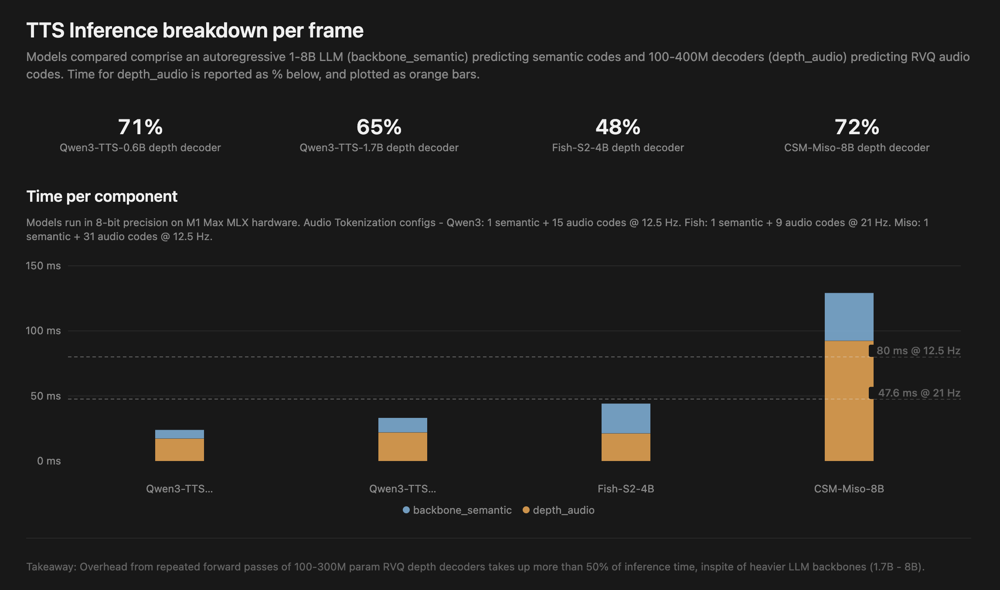

# MLX Inference breakdown

We measure per-codec-frame decode times of OSS TTS models ranging from 1.7B (Qwen3) to 8B (CSM/Miso) parameters. This is broken down by LLM backbone (semantic codes), and depth decoder (RVQ audio codes).

We see that overhead from repeated forward passes of 100-300M param RVQ audio decoders takes up more than 50% of inference time, inspite of heavier LLM backbones (1.7B - 8B).



| Model            | Native  | Backbone (semantic codes) | Depth (audio codes) | Depth % | Depth iters | ms / depth iter | Total ms | Codec frames/s | Gen RTF | Wall RTF |
| ---------------- | ------- | ------------------------- | ------------------- | ------- | ----------- | --------------- | -------- | -------------- | ------- | -------- |
| Qwen3 0.6B 8bit  | 12.5 Hz | 6.7 ms                    | 17.2 ms             | 71%     | 15          | 1.15 ms         | 24.4 ms  | 41.0           | 0.31    | 0.35     |
| Qwen3 1.7B 8bit  | 12.5 Hz | 11.2 ms                   | 22.0 ms             | 65%     | 15          | 1.46 ms         | 33.6 ms  | 29.7           | 0.42    | 0.47     |
| Fish S2 Pro 8bit | 21 Hz   | 22.9 ms                   | 21.2 ms             | 48%     | 9           | 2.36 ms         | 44.1 ms  | 22.7           | 0.93    | 1.13     |
| MisoTTS 8bit     | 12.5 Hz | 36.7 ms                   | 92.4 ms             | 72%     | 31          | 2.98 ms         | 129.1 ms | 7.7            | 1.61    | 1.80     |

6 prompts per model, 8-bit MLX checkpoints, on M1 Max Apple Silicon. **RTF** = time / audio duration (&lt;1 faster than realtime, &gt;1 slower). **Gen RTF** = native Hz / codec frames/s; **Wall RTF** = end-to-end including codec decode (`mean_rtf`).

## Reproduce

Use [`mlx_decode`](../../mlx_decode/README.md) benchmark harness. Run from the repo root:

```bash
uv pip install -e ".[mlx_decode]"
# downloads models to HF_CACHE on first run
python mlx_decode/cli.py --model <qwen3|fish|miso> 
```
