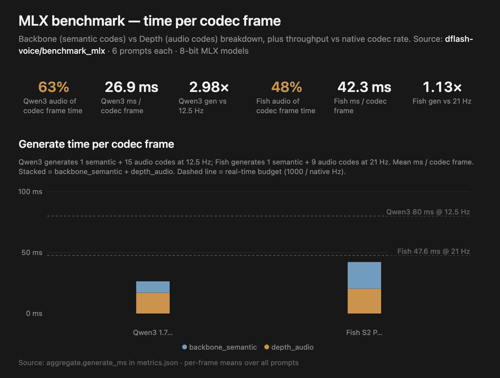

# MLX decoding time breakdown

Per-codec-frame timing breakdown of MLX TTS inference across Qwen3, Fish, and Miso 8-bit checkpoints — backbone (semantic codes) vs depth decoder (RVQ audio codes) generation, plus codec decode. Every model generates one codec frame per autoregressive step, so timings are reported per step. The depth decoder generating RVQ audio codes dominates the per-frame cost (orange bars below).



Results below are pooled over 6 prompts per model, from `mlx_decode/output/*/metrics.json`:

| Model            | Native  | Backbone (semantic codes) | Depth (audio codes) | Depth % | Depth iters | ms / depth iter | Total ms | Codec frames/s | Gen RTF | Wall RTF |
| ---------------- | ------- | ------------------------- | ------------------- | ------- | ----------- | --------------- | -------- | -------------- | ------- | -------- |
| Qwen3 0.6B 8bit  | 12.5 Hz | 6.7 ms                    | 17.2 ms             | 71%     | 15          | 1.15 ms         | 24.4 ms  | 41.0           | 0.31    | 0.35     |
| Qwen3 1.7B 8bit  | 12.5 Hz | 11.2 ms                   | 22.0 ms             | 65%     | 15          | 1.46 ms         | 33.6 ms  | 29.7           | 0.42    | 0.47     |
| Fish S2 Pro 8bit | 21 Hz   | 22.9 ms                   | 21.2 ms             | 48%     | 9           | 2.36 ms         | 44.1 ms  | 22.7           | 0.93    | 1.13     |
| MisoTTS 8bit     | 12.5 Hz | 36.7 ms                   | 92.4 ms             | 72%     | 31          | 2.98 ms         | 129.1 ms | 7.7            | 1.61    | 1.80     |

6 prompts per model, 8-bit MLX checkpoints, Apple Silicon. **RTF** = time / audio duration (&lt;1 faster than realtime, &gt;1 slower). **Gen RTF** = native Hz / codec frames/s; **Wall RTF** = end-to-end including codec decode (`mean_rtf`).

Real-time budgets: Qwen3 / Miso @ 12.5 Hz → 80 ms/frame; Fish @ 21 Hz → 47.6 ms/frame.


## Reproduce

Use [`mlx_decode`](../../mlx_decode/README.md) benchmark harness. Run from the repo root:

```bash
uv pip install -e ".[mlx_decode]"
# downloads models to HF_CACHE on first run
python mlx_decode/cli.py --model <qwen3|fish|miso> 
```
